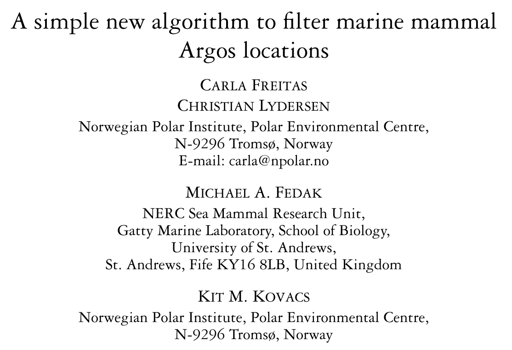
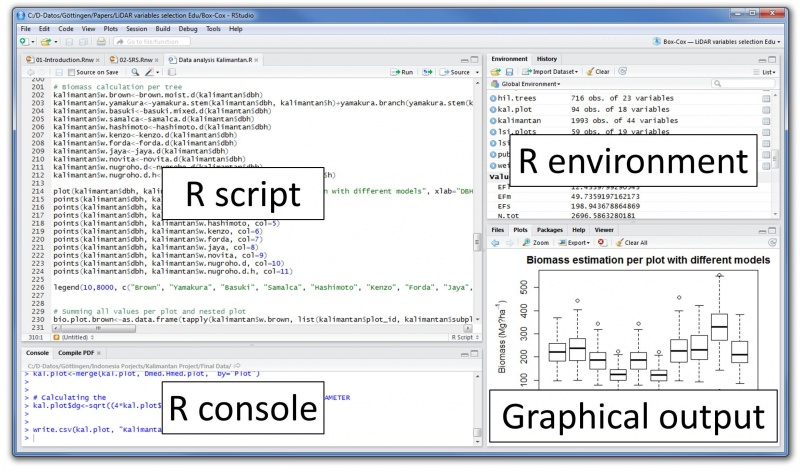
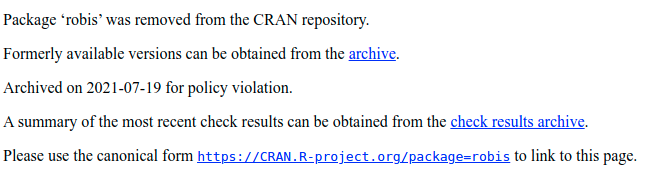

# O Básico do R

## O que é o R?
- Uma calculadora?
```{r}
2+2
4*10
sqrt(16)
```

## O que é o R?
- Um software de estatística?
```{r}
mean(c(2,3,5,8,9,5))
sd(c(2,3,5,8,9,5))
median(c(2,3,5,8,9,5))
```

## R é o idioma da ciência
<center>
{width=60%}


## RStudio
<center>
{width=100%}

# Pacotes

## Maior trunfo do R
- Grande quantidade de desenvolvedores (open-source)
- Instalando e baixando pacotes (apenas na 1ª vez)
```{r, eval=F, message=F}
install.packages('ggplot2')
```
- Carregando pacotes (sempre que for usar)
```{r, eval=F, message=F}
library(ggplot2)
```


## OBIS

OBIS é um repositório global open-access sobre dados de biodiversidade marinha para ciência, conservação e desenvolvimento sustentável.
<p>
<p>
<https://obis.org/>
<p>
<p>

<center>
{width=50%}

## Robis
<center>
{width=80%}
<left>
```{r, echo = TRUE, warning=FALSE, message=FALSE}
# instalando o pacote
#remotes::install_github("iobis/robis")
library(robis)
```

## Documentação
```{r, echo = FALSE}
knitr::include_url("https://obis.org/manual/intror/")
```

## O comando "occurrence"
```{r, echo = FALSE}
knitr::include_url("https://www.rdocumentation.org/packages/robis/versions/1.0.1/topics/occurrence")
```

## Grupos taxonomicos
```{r, echo = FALSE}
knitr::include_url("https://obis.org/manual/darwincore/#taxonomy")
```

## Robis
```{r, echo = TRUE, message=FALSE, warning=FALSE}
data<-occurrence(scientificname = "Caretta caretta", 
                 startdate = '2020-01-01')
```

## O DF resultante
- Nº de registros
```{r, echo = TRUE, message=FALSE, warning=FALSE}
nrow(data)
```
- Nº de variáveis
```{r, echo = TRUE, message=FALSE, warning=FALSE}
length(data)
```

## O DF resultante
```{r, echo = TRUE, message=FALSE, warning=FALSE}
names(data)
```
# Dados espaciais no R

## O maravilhoso pacote SF
- <https://r-spatial.github.io/sf/>
```{r, echo = TRUE, message=FALSE, warning=FALSE}
library(sf)
s<-read_sf("input_data/sbs_case_study.shp")
s$area<-st_area(s)
s<-s[1,]
s
```

## A estrutura SF
- Um data frame comum (com n variáveis)
- Uma variável especial: geometria (pontos, linhas, polígonos)
```{r, echo = TRUE, message=FALSE, warning=FALSE}
plot(s)
```

## Simplificando a geometria
```{r, echo = TRUE, message=FALSE, warning=FALSE}
s_simple<-st_simplify(s,dTolerance=5000)
plot(s_simple)
```

## Filtrando OBIS pela localização
```{r, echo = TRUE, message=FALSE, warning=FALSE}

data<-occurrence( scientificname = "Annelida",
                 geometry=st_as_text(s_simple$geometry))
nrow(data)
```
# Dplyr
## dplyr: A Grammar of Data Manipulation
- Ferramenta rápida e consistente para manipular df
```{r, echo = TRUE, message=FALSE, warning=FALSE}
library(dplyr)
dataf<- data%>%
        filter(institutionCode=='USP')%>%
        select(date_year,scientificName, family, sst, shoredistance, depth)%>%
        mutate(costeira=shoredistance<19312)%>%
        arrange(date_year)
nrow(dataf)
```
## 
```{r, echo = F, message=FALSE, warning=FALSE}
library(knitr)
kable(dataf)
```
# GGPLOT
## Vantagens
- Lindos gráficos altamente customizáveis
- Excelente documentação
- <https://r-graphics.org/>
<p>
<p>
<left>
{width=30%}

## Gráficos de análise exploratoria
```{r, echo = TRUE, message=FALSE, warning=FALSE}
library(ggplot2)
ggplot(data,aes(x=subclass))+geom_histogram(stat='count')
```

## Gráficos de análise exploratoria
```{r, echo = TRUE, message=FALSE, warning=FALSE}
ggplot(data,aes(x=depth))+geom_histogram()+
  theme_bw()
```

## Gráficos de análise exploratoria
```{r, echo = TRUE, message=FALSE, warning=FALSE}
ggplot(data,aes(x=depth))+geom_histogram(bins=10)+
  theme_bw()+xlab('Profundidade (m)')+ylab('Nº de Ocorrências')
```

## Gráficos de análise exploratoria
```{r, echo = TRUE, message=FALSE, warning=FALSE}
ggplot(data,aes(x=as.numeric(year),fill=order))+geom_bar()+
  theme_bw()+ xlab(NULL)+ylab('Nº de Ocorrências')+xlim(c(1990,2020))
```

## Gráficos de análise exploratória
```{r, echo = TRUE, message=FALSE, warning=FALSE}
ggplot(data,aes(x=order,y=depth))+geom_boxplot()+
  theme_bw()+xlab(NULL)+ylab('Profundidade')
```

## Gráficos de análise exploratória
```{r, echo = TRUE, message=FALSE, warning=FALSE}
ggplot(data,aes(y=decimalLatitude))+geom_density()+
  theme_bw()+
  xlab('Densidade de Ocorrência')+ylab('Latitude')
```

# Mapas dinâmicos

## Leaflet
```{r, echo = TRUE, message=FALSE, warning=FALSE}
map_leaflet(data, color='black', provider_tiles = "Esri.OceanBasemap",
            popup=function(x){x["scientificName"]})
```

## Exportação dos dados
- CSV
```{r, echo = TRUE, message=FALSE, warning=FALSE}
write.csv2(data,file='annelida.csv')
```

- Excel
```{r, echo = TRUE, message=FALSE, warning=FALSE}
library(writexl)
write_xlsx(data,path = 'annelida.xlsx')
```
- Arquivo do R
```{r, echo = TRUE, message=FALSE, warning=FALSE}
save(data,file='annelida.Rda')
```
## Convertendo para Shapefile
```{r, echo = TRUE, message=FALSE, warning=FALSE}
data_sf<-st_as_sf(data, 
                  coords=c("decimalLongitude","decimalLatitude"),
                  crs=4326)
plot(data_sf[5])
```

## Exportando Shapefile
```{r, echo = TRUE, message=FALSE, warning=FALSE}
write_sf(data_sf,dsn = 'annelida.shp')
```

## SIBBR (GBIF)
- Pacote rgbif
```{r, echo = FALSE}
knitr::include_url("https://www.sibbr.gov.br/")
```
## Próximos passos?
- Definição dos grupos taxonômicos de interesse
- Agregação por grids
- Presença/Ausência
- Mesclar com GBIF
- What else?

